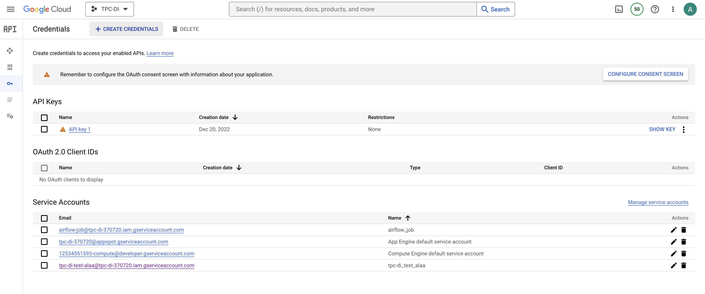
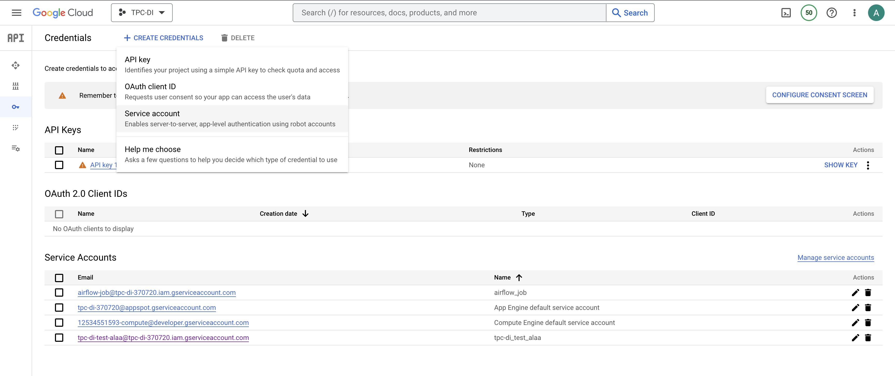
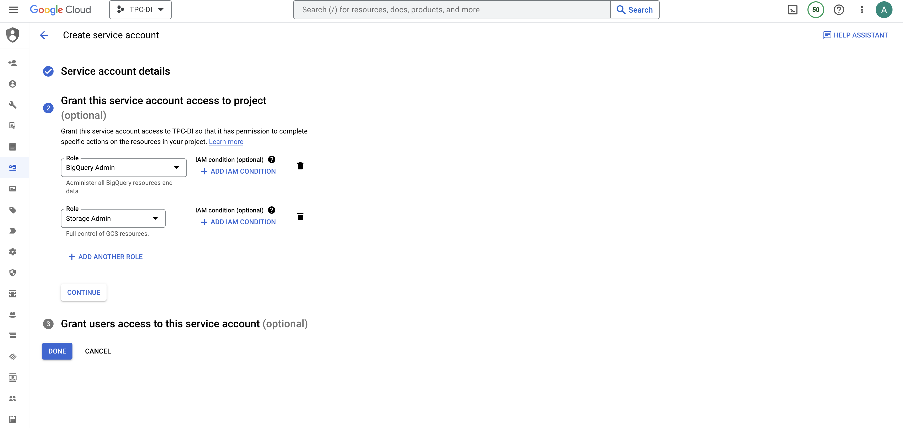
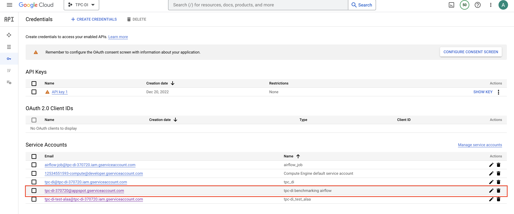
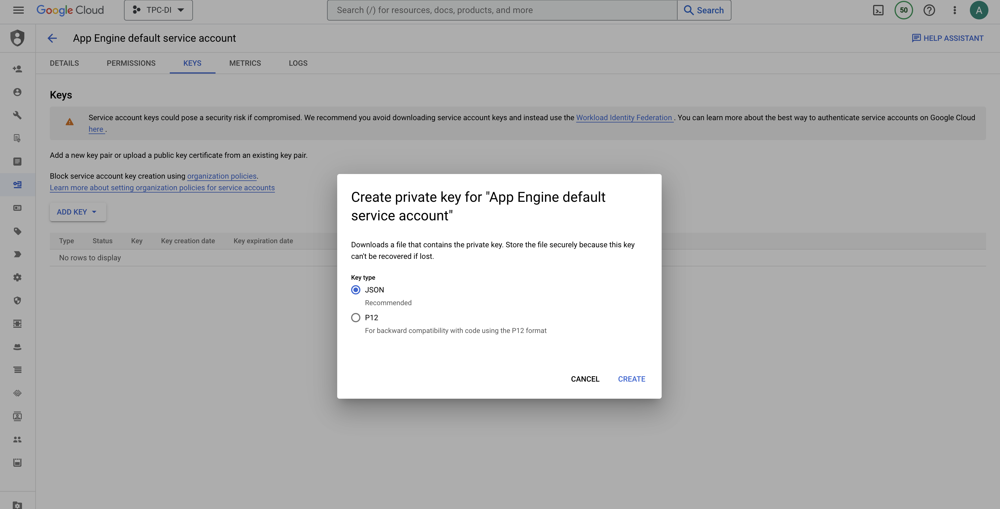
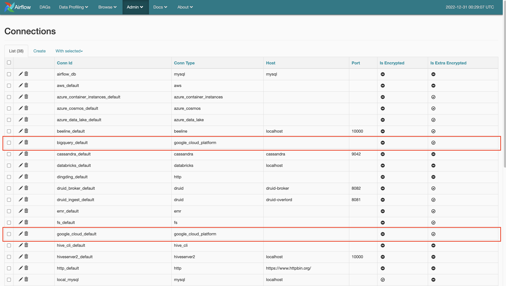
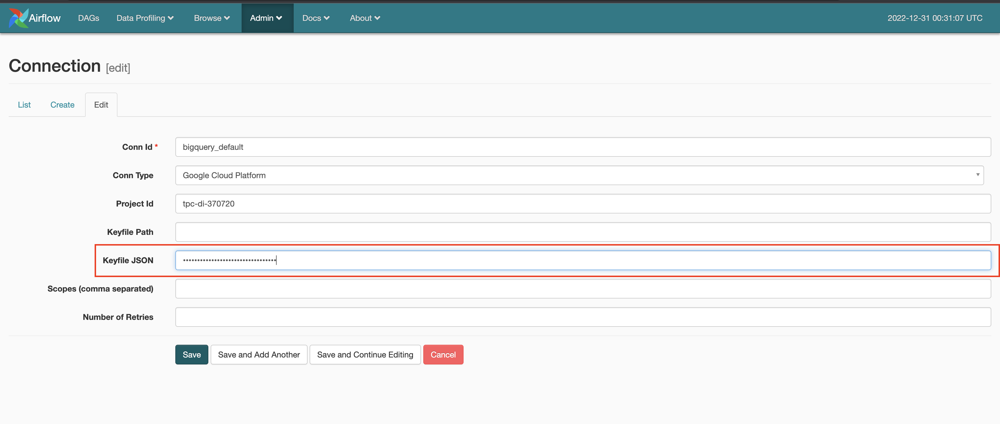

# TPC-DI: on Google Big Query using Apache Airflow - Historical Load Phase 
TPC-DI Benchmarking - INFO-H419 Project

## Apache Airflow setup

#### In our specific implementation the below steps were done on a Google Compute Engine instance E2-standard-4 

1. Clone the repository [docker-airflow](https://github.com/puckel/docker-airflow)
2. Build docker image from sources 
```console 
cd docker-airflow
docker build --rm --build-arg AIRFLOW_DEPS="gcp" -t tpc-di/benchmark-airflow .
```
3. Clone this repository
4. Navigate to where docker-compose.yml resides and then build airflow container
```console 
sudo docker-compose up -d 
```
## Before running the dag

### Upload data into GCS Bucket 

1. Create a GCS bucket and upload Batch 1 data files for the desired SF in the following directory structure tpc_di_staging_files/sf[scale]/Batch1. Where scale is a numeric value. 

#### In our specific implementation data was generated using DIGen.jar in a docker container running CentOS. (running DIGen.jar requires installaing java: yum install a java-1.8.0-openjdk)

### Create a service account in GCP 

This will enable Airflow to call Big Query and Google Cloud Storage operators

1. Go to your project, and then navigate to APIs & Services -> Credentials. 



2. Click on Create Credientials -> Sevice Account 



3. Give the service account Big Query and Google Cloud Storage Admin roles 



4. Go to the newly created service account and add a new key




5. Download the key as JSON 

### Connect Airflow to Big Query and Google Cloud Storage 

1. Go to Airflow UI, then click on Admin tab and select Connections



2. Click on the edit icon for Big Query Default. Input the Project Id and paste the json key content. 

3. The same should be done for Google Cloud Default connection. 



## Executing the DAG on Airflow 

### Constants.py 

You can adjust GCS_BUCKET name and the Scale Factor (SF) in the python script to ensure that the DAG will call the correct directories for the desired SF. 

### Execute DI process without daily_market staging table partitioning

You can trigger the following DAG: tpc_di_historical_load_v2.3

### Execute DI process with daily_market staging table partitioning

You can trigger the following DAG: tpc_di_historical_load_v2.2.1

##### Credits
[snithish/tpc-di_benchmark GitHub repository](https://github.com/snithish/tpc-di_benchmark) that helped us understand how to create Airflow environment suitable for this implementation as well as further understand the transformations.

###### This is a group project apart of INFO-H419: Data Warehouse course at ULB and was completed by: Koumudi, Adina, Zyad, Alaa


